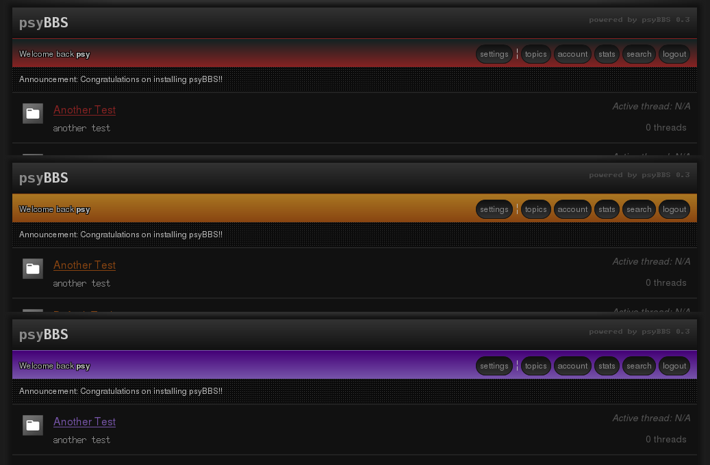
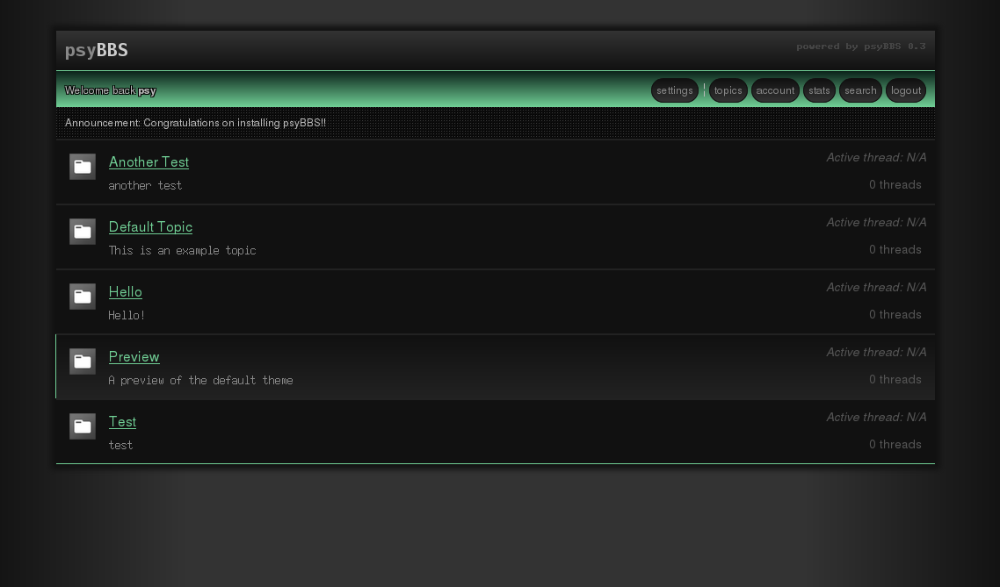

# psybbs

A GPLv3/CC licensed Bulletin Board Software using PHP/MYSQL

###What is psyBBS? 
psyBBS is a platform for managing discussions, a de-facto web forum portal. It is being put together for learning and personal use at the moment. What does psyBBS stand for? No, it has nothing to do with the korean guy. Pronounced psybbs as in 'sye'bee'bee'ess. Like sci-fi, or psycho. It doesn't really matter what, but probably something like:
* Psycho BBS
* Psylocibin BBS
* Psyche BBS
* Psychedelic BBS

Take your pick!

##NOTE
This is and will be full of bugs right now, consider this software as pre-alpha quality. Some features are missing and/or need to be rewritten. Most of the functions handling $_GET and $_POST input *should* be sanitised already. Be cautious however.

##Features
* Splash page
* Topic listing
* Thread listing (with page filter)
* Post listing (with page filter)
* Web based administration
* Login / creation captcha
* Global user customization
* Local user customization
* Simple stats
* Search querys

##Project Goals
* Minimal javascript (currently none, but may be needed to simplifying settings management)
* W3C XHTML / W3C CSS3 valid
* SQLi and XSS resistant
* Fast
* Easy to administer
* Extendable with plugins

##How to Install
* Clone the master branch into your web server root
* Add your MySQL server connectiont to include/config-example.php
* Rename it to include/config.php
* Navigate to index.php
* When processed, 'include/top.php' will check if a database exists, and otherwise creates it
* Log in with your primary admin account and click the 'settings' tab in the userbar for further configuration

##Themes
* default

##Pentesting
If you are working on a pentest script/software for finding SQLi, XSS, javascript injection or the 
likes, feel free to clone/abuse psyBBS and report any finds! Thanks, it will be highly appreciated
