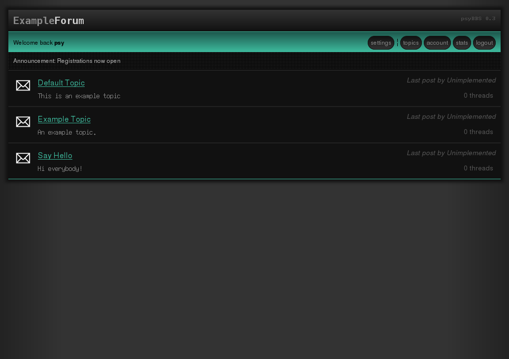

# psybbs

A GPLv3/CC0 Bulletin Board Software written in PHP/MYSQL

###What is psyBBS? 
No, it has nothing to do with the korean guy. Pronounced psybbs as in 'sye'bee'bee'ess. Like sci-fi, or psycho. What does it stand for? It doesn't really matter, but probably something like:
* Psycho BBS
* Psylocibin BBS
* Psyche BBS
* Psychedelic BBS

##NOTE
This is and will be full of bugs right now, consider this software as pre-alpha quality. Some features are missing and/or need to be rewritten.

##Project Goals
* ZERO javascript. 
* XHTML / CSS3 valid
* SQLi resistant
* Fast
* Easy to administer

##Install
* Edit include/config-example.php
* Rename include/config.php

##Theme Preview

